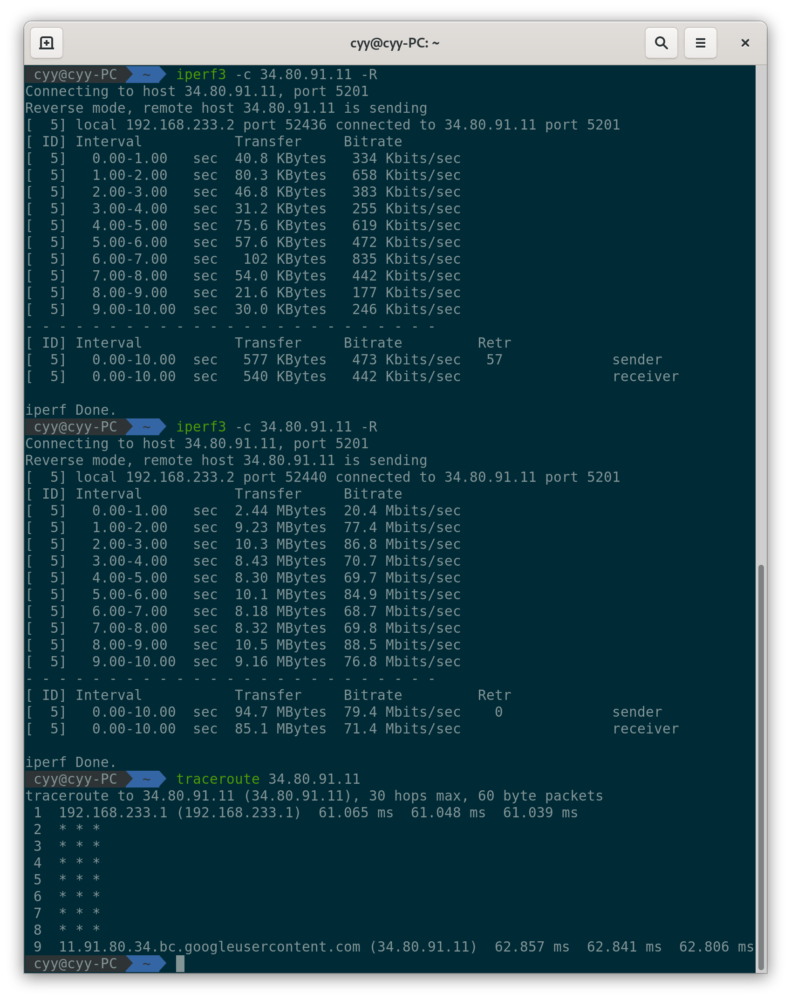

# TCPTP-booster

This is an simple program to make your Linux server act as TCP Transparent Proxy.

# Usage:
```
./tcptp-booster -l 12345
```
to make it listening on port 12345.

If there is no arguments the default listening port will be 12345.

# Application:

## Accelerate udp based VPN by TCP BBR.

If your server using advanced tcp congestion control algorithm such as TCP BBR.

And you have already setup an udp based VPN on your server such as WireGuard, OpenVPN, IPSec.

In this case, when vpn client connect to a remote server using legency tcp congestion control such as cubic, and the route between local and vpn server has high packet loss rate, the network speed will drop.

This program will help you accelerate TCP speed by advanced tcp congestion control.

### Howto:
#### 1. Build this program and install
```
git clone https://github.com/cyyself/TCPTP-booster.git
cd TCPTP-booster
make
sudo cp bin/tcptp-booster /usr/local/bin/
```
#### 2. make it running on the backgroud

You can make it running on the backgroud by systemd

Adding this to `/etc/systemd/system/tcptp-booster.service`
```
[Unit]
Description=An simple program to make your Linux server act as TCP Transparent Proxy.

[Service]
User=root
Start=/usr/local/bin/tcptp-booster
Restart=always

[Install]
WantedBy=multi-user.target

Then execute these commands:
```
systemctl daemon-reload
systemctl start tcptp-booster
systemctl status tcptp-booster
systemctl enable tcptp-booster
```

#### 3. Add rules to IP tables
```
iptables -t nat -A PREROUTING -p tcp -m tcp -s 192.168.233.0/24 -j REDIRECT --to-ports 12345
```
Please replace **192.168.233.0/24** to **your VPN client subnet**

#### 4. Enjoy it.

### Test

Explain my environment:

My local PC connect to a **192.168.233.1** via wireguard.

**192.168.233.1** is a remote vpn server using tcp bbr.

And the **34.80.91.11** is a server using cubic.

The first time I didn't add iptables rule so the speed is too low because of high packet loss.

The second time I added the iptabels rule so the tcp traffic through VPN Server will redirect to my program and using TCP BBR to acclerate the speed.


